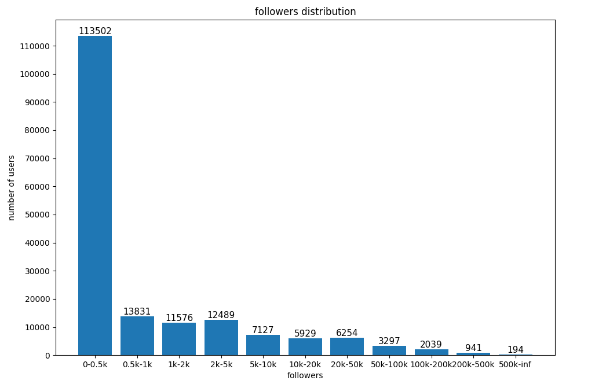

# Chinese Community on Twitter

## Overview
Estimated that there are:
- About **20 million** active Chinese users.
- About **20,000** accounts with over **10,000** followers.
- About **95%** accounts with less than 1000 followers.

Follower numbers distribution of the most influential 1771179 accounts I crawled:

## Top 100 accounts (ranked by followers number)
|rank|name|
|---|---|
|1|[CGTN](https://twitter.com/CGTNOfficial)|
|2|[People's Daily, China](https://twitter.com/PDChina)|
|3|[Dwight Howard](https://twitter.com/DwightHoward)|
|4|[China Daily](https://twitter.com/ChinaDaily)|
|5|[Naimi奶咪](https://twitter.com/Anaimiya)|
|6|[H.E. Justin Sun 孙宇晨](https://twitter.com/justinsuntron)|
|7|[BBC News 中文](https://twitter.com/bbcchinese)|
|8|[纽约时报中文网](https://twitter.com/nytchinese)|
|9|[蔡英文 Tsai Ing-wen](https://twitter.com/iingwen)|
|10|[HongKongDoll](https://twitter.com/HongKong_Doll)|
|11|[华尔街日报中文网](https://twitter.com/ChineseWSJ)|
|12|[HTC](https://twitter.com/htc)|
|13|[Amber Liu 刘逸云](https://twitter.com/amberliu)|
|14|[Hua Chunying 华春莹](https://twitter.com/SpokespersonCHN)|
|15|[China Science](https://twitter.com/ChinaScience)|
|16|[Testosterone](https://twitter.com/badassceo)|
|17|[美国之音中文网](https://twitter.com/VOAChinese)|
|18|[Lijian Zhao 赵立坚](https://twitter.com/zlj520)|
|19|[Beautiful China](https://twitter.com/PDChinaLife)|
|20|[Global Times](https://twitter.com/globaltimesnews)|
|21|[菌烨tako](https://twitter.com/Takomayuyi)|
|22|[美国驻华使领馆 US MissionCN](https://twitter.com/USA_China_Talk)|
|23|[Kai-Fu Lee](https://twitter.com/kaifulee)|
|24|[JuneLiu SpicyGum🍬](https://twitter.com/SpicygumL)|
|25|[New China 中文](https://twitter.com/XinhuaChinese)|
|26|[自由亚洲电台](https://twitter.com/RFA_Chinese)|
|27|[蘋果新聞網 Taiwan News](https://twitter.com/TW_nextmedia)|
|28|[性瘾患者小姨妈](https://twitter.com/MaecOXO)|
|29|[rioko凉凉子](https://twitter.com/rioko041123)|
|30|[RFI 华语 - 法国国际广播电台](https://twitter.com/RFI_Cn)|
|31|[联合早报 Lianhe Zaobao](https://twitter.com/zaobaosg)|
|32|[阳布布鸭](https://twitter.com/minicuteaa)|
|33|[李老师不是你老师](https://twitter.com/whyyoutouzhele)|
|34|[蠢沫沫momo-](https://twitter.com/chunmomo0132)|
|35|[old先](https://twitter.com/old_xian)|
|36|[China.org.cn](https://twitter.com/chinaorgcn)|
|37|[Naimi奶咪5](https://twitter.com/Anaimiya2)|
|38|[DW 中文- 德国之声](https://twitter.com/dw_chinese)|
|39|[CCTV](https://twitter.com/CCTV)|
|40|[每日大作战](https://twitter.com/MeiRiDaZuoZhan)|
|41|[94邀一下](https://twitter.com/91porm)|
|42|[HongKongDoll](https://twitter.com/MyHongKongDoll)|
|43|[大佛的小屋](https://twitter.com/DaFoer_)|
|44|[Hakken 八犬](https://twitter.com/HakkenRyou)|
|45|[lidang 立党](https://twitter.com/lidangzzz)|
|46|[阿朱啊](https://twitter.com/azhua2000)|
|47|[小池百合子](https://twitter.com/ecoyuri)|
|48|[肉便犬育成訓練](https://twitter.com/KuangKu57395142)|
|49|[謝侑芯Iris](https://twitter.com/irisirisss523)|
|50|[Modern China](https://twitter.com/PDChinaBusiness)|
|51|[精品私房](https://twitter.com/woaisifang)|
|52|[𝗝 𝗘 𝗙 𝗙 𝗦 𝗔 𝗧 𝗨 𝗥 (罗杰夫)](https://twitter.com/jeffsatur)|
|53|[人民日報  People's Daily](https://twitter.com/PDChinese)|
|54|[-你烨烨-](https://twitter.com/niyeye2022)|
|55|[汐酱才不是肉便器呐](https://twitter.com/Slut_Xi)|
|56|[Sally多啦雪(iamdorasnow)](https://twitter.com/iamdorasnow)|
|57|[方舟子](https://twitter.com/fangshimin)|
|58|[日日大赛](https://twitter.com/riridasai)|
|59|[WSJ China Real Time](https://twitter.com/ChinaRealTime)|
|60|[👑𝐌ⁱˢˢ大猫](https://twitter.com/Damaozi_)|
|61|[Saintsup 🌶](https://twitter.com/Saint_sup)|
|62|[Fei](https://twitter.com/wangfeifei0432)|
|63|[王局志安](https://twitter.com/wangzhian8851)|
|64|[Natsume✨枣糕](https://twitter.com/natsume3v0)|
|65|[九儿๑](https://twitter.com/wrmm523)|
|66|[炮椒番茄（🍑TB：撒哈拉绿洲）](https://twitter.com/paojiaofanqie)|
|67|[依酱](https://twitter.com/yijiang1018)|
|68|[🍑♡TiTi鈦合金♡ 🍑](https://twitter.com/TiTi40511555)|
|69|[二佐Nisa](https://twitter.com/Erzuoxxxx)|
|70|[The Lancet](https://twitter.com/TheLancet)|
|71|[Tsinghua University](https://twitter.com/Tsinghua_Uni)|
|72|[CGTN Radio](https://twitter.com/CGTNRadio)|
|73|[橙子喵酱](https://twitter.com/chengzimiaoj)|
|74|[🍃宇宙少女小佐](https://twitter.com/huang520523)|
|75|[NinJA阿寨寨](https://twitter.com/NinJA_Azz)|
|76|[🦈鲨鱼大大](https://twitter.com/pubccs)|
|77|[获取视频机器人](https://twitter.com/shipinbot)|
|78|[Joshua Wong 黃之鋒 😷](https://twitter.com/joshuawongcf)|
|79|[⚡️⚡️⚡️](https://twitter.com/Flashhotwife)|
|80|[Peking University](https://twitter.com/PKU1901)|
|81|[FlyOverChina](https://twitter.com/FlyOverChina)|
|82|[Miu_Cosplayer](https://twitter.com/smilecutty)|
|83|[Jack Ma](https://twitter.com/JackMa)|
|84|[小騷女♥](https://twitter.com/lkjh489357)|
|85|[七月喵子](https://twitter.com/qiyuemiaozi)|
|86|[94PORN官方](https://twitter.com/91porn)|
|87|[每日大赛](https://twitter.com/shutiao1125)|
|88|[Spokesperson发言人办公室](https://twitter.com/MFA_China)|
|89|[每日大赛](https://twitter.com/chuxianglua4)|
|90|[sxxcouple](https://twitter.com/sxxcouple)|
|91|[⃝👑𝐌ⁱˢˢ鲨鱼辣椒](https://twitter.com/Lajiaoshayu_)|
|92|[China News 中国新闻网](https://twitter.com/Echinanews)|
|93|[Matcha🍵](https://twitter.com/matchach)|
|94|[w百合欧皇子w](https://twitter.com/Lilium728)|
|95|[精華薈萃-不再接投稿](https://twitter.com/jinghuahuicui)|
|96|[蔡霞](https://twitter.com/realcaixia)|
|97|[崔永元](https://twitter.com/YongyuanCui4)|
|98|[Momo Kawaii🍑小桃🍑 FREE SET PATRE3N](https://twitter.com/sayomomoo)|
|99|[水淼Aqua](https://twitter.com/aqua28551267)|
|100|[4nnn](https://twitter.com/Yibeibuchi_)|
